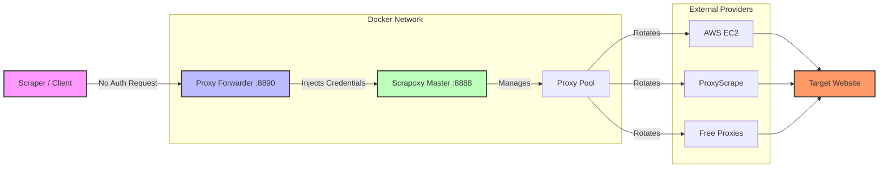

# Scrapoxy Local Gateway

**Scrapoxy Local Gateway** is a production-ready, Dockerized deployment of Scrapoxy designed for seamless local proxy management. It features a custom "No-Auth" sidecar service that eliminates the need for credential management in your scrapers, allowing direct access via `localhost`. This setup provides a unified dashboard to manage diverse proxy providers (AWS, DigitalOcean, Free Proxies) while offering a simplified, open proxy endpoint for your development and scraping workflows.

## Features

- **Scrapoxy**: The standard Scrapoxy super-proxy aggregator.
- **No-Auth Forwarder**: A custom Node.js sidecar that handles authentication for you, allowing you to connect to `http://localhost:8890` without credentials.
- **Dockerized**: Fully containerized for easy management.
- **Environment Management**: Configuration via `.env` file.

## Prerequisites

- Docker & Docker Compose installed.
- Node.js (optional, only if you want to run scripts locally without Docker).

## Quick Start

1.  **Run the setup script:**
    ```bash
    ./run.sh
    ```
    This will create a `.env` file (if missing), build the containers, and start the services.

2.  **Configure Project Credentials (First Time Only):**
    Scrapoxy requires a project to be created to generate proxy credentials.
    
    - Open the Commander GUI: [http://localhost:8889](http://localhost:8889)
    - Log in with the credentials from your `.env` file (Default: `admin` / `password`).
    - **Create a new Project**.
    - In the project dashboard, find the **Proxy Credentials** (Username and Password).
    - Open the `.env` file in this directory.
    - Update `PROJECT_PROXY_USERNAME` and `PROJECT_PROXY_PASSWORD` with the values from the dashboard.

3.  **Restart:**
    Run the script again to apply the new credentials:
    ```bash
    ./run.sh
    ```

## Usage

- **Proxy URL**: `http://localhost:8890`
  - Use this URL in your scraper. No username or password is required.
  - It forwards traffic to Scrapoxy, automatically adding the authentication headers.

- **Commander GUI**: `http://localhost:8889`
  - Manage your connectors (AWS, DigitalOcean, etc.) and view stats.

### Important: Adding Proxies
The error `Cannot find any proxy` means Scrapoxy has no active proxies to route your request. You must add a connector:

1.  **Open Commander**: Go to [http://localhost:8889](http://localhost:8889).
2.  **Add Connector**: Navigate to the **Connectors** section.
    - For a quick test, add the **Freeproxies** connector.
    - For production, add a cloud provider (AWS, DigitalOcean, etc.).
3.  **Start/Scale**:
    - If using Freeproxies, it will automatically find public proxies.
    - If using a cloud provider, click the **Play** button or adjust the scaling to start instances.
4.  **Wait**: Wait until you see green "Live" proxies in the dashboard before making requests.

## Configuration

Edit the `.env` file to change settings:

- `AUTH_LOCAL_USERNAME` / `PASSWORD`: Login for the GUI.
- `COMMANDER_PORT`: Port for the GUI (Default: 8889).
- `PROXY_PORT`: Port for the No-Auth Proxy (Default: 8890).

## Architecture



1.  **Client**: Connects to `localhost:8890` without credentials.
2.  **Proxy Forwarder**: Intercepts the request, adds the `Proxy-Authorization` header (using credentials from `.env`), and forwards it to Scrapoxy.
3.  **Scrapoxy**: Receives the authenticated request and routes it through one of the active proxies in the pool.
4.  **Providers**: The actual proxy instances (Cloud or Free) that make the request to the target.

## Troubleshooting

- **Proxy Connection Failed**: Ensure you have updated the `.env` file with the correct Project Credentials from the Scrapoxy GUI and restarted the containers.
- **Docker Errors**: Make sure Docker is running.
